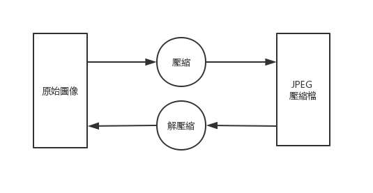
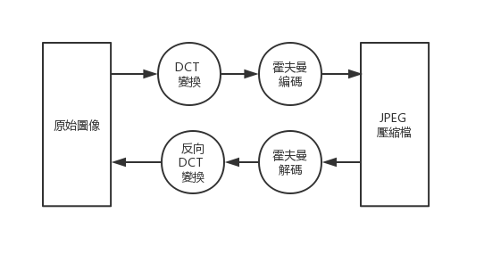
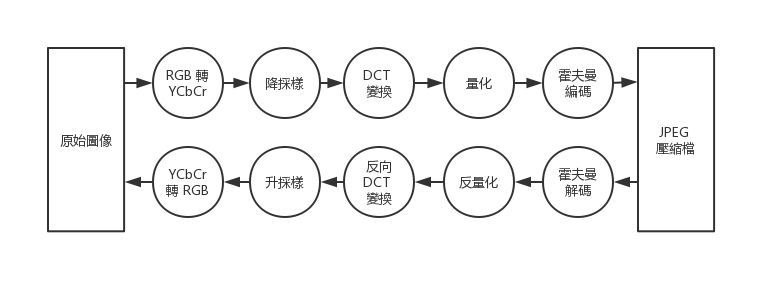

# 跟我寫 JPEG 解碼器（一）概述

## JPEG 規範雜談

### JPEG 規範的是一組而非一個算法

JPEG 這個標準其實定義了多種壓縮算法以及編碼方式，也就是說，兩份 .jpg 的圖片在背後使用的算法可能各自不同。

我們先以壓縮算法來加以區分，共有四種：

- 循序（sequential）
- 遞進（progressive）
- 層次（hierarchical）
- 無損（lossless）

除了第四項的「無損」之外，其他三樣都是有損的，sequential 跟 progressive 的差別，我們看圖比較快：

（聲明：圖片來自[此網站](https://www.biaodianfu.com/progressive-jpeg.html)）

sequential 會由上而下解碼（其實也可以沿其他方向）

progressive 則在解碼的過程中，從模糊漸漸變得清晰

而 hierarchical 類似於 progressive 的效果，但用了更加激進的方式，它會分別對一張圖片的不同解析度進行編碼。

除了以上四種壓縮算法的差別，在編碼時，也能夠選擇使用

- 霍夫曼編碼
- 算術編碼

這兩種不同的編碼方式。

除了壓縮算法跟編碼方式之外，還有一些參數可以調整，此處介紹一個較爲重要的：數據的精度。精度就是採樣時分割的細粒程度，譬如說，體重計能量測 0 ~ 128 公斤，那 8bit 的精度就足以採樣到 0.5 公斤的誤差。

### baseline 流程

所有 JPEG 規範組合中，最爲簡單的一種就是 baseline 流程，它

- 循序（sequential）
- 霍夫曼編碼
- 精度爲 8bit

雖然說它是最簡單的，但也是最常被使用了，提供個簡單的數據，我隨機從不同網站下載跟生成了七張圖片，其中就有六張使用了 baseline 流程，僅有一張採用了 progressive 的壓縮方式。

簡單又常用，是再容易不過的教學題目了。在往後的文章中，我們就先專注在 baseline 流程的 JPEG 上。

### JFIF 標準

僅僅閱讀 JPEG 標準書，並無法解讀網路上所流通的 .jpg 檔，那是因爲這些 .jpg 檔，幾乎都服膺於另一個額外標準 JFIF。

 JPEG 標準在 JPEG 的檔案結構中預留了數個可選的標頭，目的是供應用程式能夠進一步加以拓展、或是添加額外訊息，JFIF 就在是最泛用的一種，它在 JPEG 的標準之外定義了縮圖大小、在不同裝置上的顯示比例。

 除了這些額外訊息， JFIF 也對 JPEG 加以限縮，例如限制了色彩空間。

我們之後要撰寫的解碼器，並不會處理到縮圖、顯示比例等等問題（畢竟這對理解編解碼並無幫助），因此 JFIF 的額外資訊我們基本不去管它，但是 JFIF 添加的限制，可以讓我們考慮更少狀況，解讀圖片時能夠更輕鬆。往後使用到 JFIF 所定義標準時，會特別提及。

### 總結
在後文中，我們要解碼的是：

- 符合 JFIF 標準
- 採用 baseline 流程

的 .jpg 圖片

## JPEG 編／解碼流程

先看一張最簡單的圖

相信這張圖非常簡單易懂，我們接著將壓縮與解壓縮的流程放大來看，baseline JPEG 會透過 DCT 變換，將原色彩空間映射到新空間，再使用霍夫曼編碼嘗試進行壓縮。

解碼時則全部反過來，如下示意圖

DCT 變換以及霍夫曼編碼，都是完全可逆的運算，也就是說這樣得到的壓縮檔是無損的，爲了進一步提高壓縮率， baseline JPEG 還會拋棄掉一些人類視覺上感受不明顯的資訊：

- 將顏色從 RGB 空間轉換成 YCbCr 空間後，降採樣
- 在 DCT 變換之後，量化新空間裡的數據

以上這兩點都是有損的，是降低壓縮檔資料大小的最主要流程，加入這兩項之後，我們將示意圖更新爲

這張圖差不多把 JPEG 編解碼的主要流程畫出來了，但要寫一個解碼器，這些知識是遠遠不夠的，我們仍得瞭解更多細節。

## Q&A

- Q: 什麼是 DCT 變換、降採樣、霍夫曼編碼、YCbCr 色彩空間、量化？它們又爲什麼可以壓縮資料？
  
  A: 請見 [（附錄一）理論基礎]( ./跟我寫jpeg解碼器（附錄一）理論基礎.md )