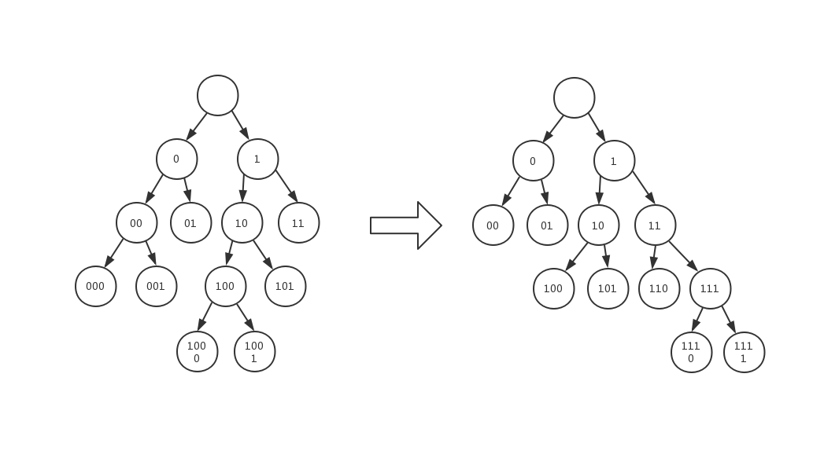
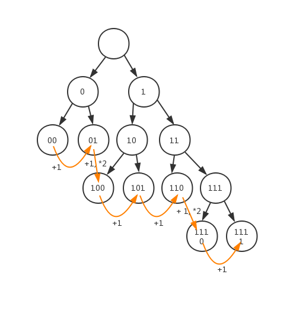
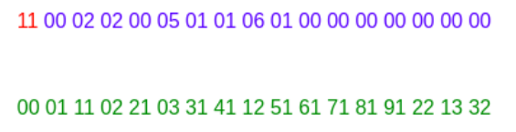

# 跟我寫 JPEG 解碼器（三）讀取量化表、霍夫曼表

## 本章目標

在[上一章](./跟我寫jpeg解碼器（二）檔案結構.md)提到，要解碼 baseline JPEG ，僅需要認識 6 個標頭，扣除掉不含數據的檔頭、檔尾標記，我們僅需要讀取 4 個區段。

本章將會讀取量化表（DHT）跟霍夫曼表（DQT）。

| 區段 | 進度 |
|------|------|
| DQT  | ✅    |
| DHT  | ✅    |
| SOF0 |      |
| SOS  |      |

## 範例程式碼：讀取各區段
（待補位置）

## 讀取量化表（DHT）

| 代號 | 大小           | 描述                                                                                      |
|------|----------------|-------------------------------------------------------------------------------------------|
| ①    | 1 byte         | 高 4 bits 表示每個量化值的大小，0 代表 1 byte，1 代表 2 bytes 低 4 buts 表示本量化表的 id ， id 可爲 0, 1, 2, 3 |
| ②    | 64 或 128 byte | 64 個 1 或 2 bytes 的量化值，是 1 byte 還是 2 bytes 取決於 ①  的高 4 bits     |

量化表是最容易讀取的區段，值得注意的是，量化表區段最多可能有 4 個。

在之後[講解解碼的章節](待補鏈接)會看到，不同的壓縮數據可能會指定不同的量化表，以此更加提升壓縮比。

## 讀取霍夫曼編碼表

在讀取 JPEG 的霍夫曼表之前，先介紹何謂範式霍夫曼編碼

### 範式霍夫曼編碼

我們先看左側的霍夫曼樹，它長得有點雜亂是吧？把它規範一下，所有節點維持高度不變，但全數盡可能往右移動。得到右圖，它看起來整齊多了，由於兩顆樹的葉子節點高度相等，它們的壓縮率也完全相等。

如果我們用左側這顆樹來記錄編碼訊息，需要將整棵樹的結構都記錄下來，但右側的樹並不需要，因爲它經過規範，我們只要記錄**在高度 h 時，有幾個葉子節點**，就能夠完全復原出右側的霍夫曼樹。因此規範霍夫曼樹能夠減少儲存編碼訊息的空間用量。

舉例來說上圖右側的樹，我們只要記錄：

| 高度 | 葉子節點個數 |
|------|--------------|
| 0    | 0            |
| 1    | 0            |
| 2    | 2            |
| 3    | 3            |
| 4    | 2            |

即可還原

#### 遍歷葉子節點

被規範過後的霍夫曼樹還可以很快速地遍歷葉子節點的碼字，觀察下圖

我們很容易就能證明，當從左到右，從上到下遍歷葉子節點時：

- 若高度相等：$leaf[n] = leaf[n - 1] + 1$
- 若高度差 1 ：$leaf[n] = (leaf[n - 1] + 1) * 2$
- 若高度差 k ：$leaf[n] = (leaf[n - 1] + 1) * 2^k$

高度爲 n 的那條規則其實蘊含了高度相等與高度差 1 的規則。

這個特性可以用於加速解碼。

### JPEG 中的霍夫曼表

一般來說，JPEG 中會包含 4 個霍夫曼表，這些霍夫曼表可能會分散在多個 DHT 區段，也有可能集中在一個 DHT 區段。

根據使用的時機不同，分爲

- 直流 0 號 (DC 0)
- 直流 1 號 (DC 1)
- 交流 0 號 (AC 0)
- 交流 1 號 (AC 1)

一個 DHT 區段可能會包含一個或多個霍夫曼表，究竟是一個還是多個，可以由區段長度來判斷，如果讀取完一個霍夫曼表之後，目前讀取的數據量小於區段長度，就代表還有下一個霍夫曼表。

下表描述了一個霍夫曼表

| 代號 | 大小                 | 描述                                                                                                               |
|------|----------------------|--------------------------------------------------------------------------------------------------------------------|
| ①    | 1 byte               | 高 4 bits 代表本表是直流還是交流， 0 是直流， 1 是交流 低 4 bits 代表是 0 號表還是 1 號表， 0 是 0 號 ， 1 是 1 號 |
| ②    | 16 bytes             | 第 n 個 byte 代表高度爲 (n - 1) 時，霍夫曼樹有幾個葉子節點                                                         |
| ③    | 葉子節點數量個 bytes | 代表葉子節點所對應的信源符號，葉子從低到高，從左到右                                                           |

接下來拿個[現成](https://www.jianshu.com/p/c4ab7f92d0e1)的範例解說，以下是一個是一個霍夫曼表的 hex 表示

- ① 紅色部分：0x11 代表直流 1 號。
- ② 紫色部分：高度爲 0 的葉子節點 0 個，高度爲 1 的葉子節點 2 個，高度爲 2 的葉子節點 2 個，高度爲 2 的葉子節點 0 個，高度爲 4 的葉子節點 5 個 ......
- ③ 綠色部分：將紫色部分的數值加總，得到葉子節點的數量，2 + 2 + 5 + 1 + 1 + 6 + 1 = 17
  
  所以綠色部分應該有 17 個數值，分別代表葉子節點對應的信源符號
  上一小節提到過，葉子節點的碼字可以用 $leaf[n] = leaf[n - 1] * 2^k$ 來遍歷，所以我們可以很迅速的將碼字和信源符號進行對應。

  在本例中，最低的葉子節點（我們將之設爲 $leaf[1]$）高度爲 1 ，觀察規範樹，易知該葉子節點的碼字爲 0b0 （若最低的節點高度爲 h，那該節點碼字爲 h 個 0），碼字 0 對應信源符號的 0x00 。
  
  由於下一個葉子節點的高度仍爲 1 ，根據公式，$leaf[2] = (leaf[1] + 1) * 2^0 = 0b0 + 1 = 0b1$。碼字 0b1 對應信源符號 0x11。

  在下一個葉子節點，$leaf[3]$的高度爲 2 ，因爲與前一個節點高度差 1 ，因此根據公式計算 $leaf[3] = (leaf[2] + 1) * 2^1 = 0b100$ 。碼字 0b100 對應信源符號 0x02。

  之後的節點以此類推。

全部解碼完成，應該會得到下表，你可以對照以確認自己理解了霍夫曼樹的建構過程。

| 葉子節點序號 | 碼字長度 | 碼字    | 信源編碼 |
|--------------|----------|---------|----------|
| 1            | 2        | 00      | 0x00     |
| 2            | 2        | 01      | 0x01     |
| 3            | 3        | 100     | 0x11     |
| 4            | 3        | 101     | 0x02     |
| 5            | 5        | 11000   | 0x21     |
| 6            | 5        | 11001   | 0x03     |
| 7            | 5        | 11010   | 0x31     |
| 8            | 5        | 11011   | 0x41     |
| 9            | 5        | 11100   | 0x12     |
| 10           | 6        | 111010  | 0x51     |
| 11           | 7        | 1110110 | 0x61     |
| 12           | 7        | 1110111 | 0x71     |
| 13           | 7        | 1111000 | 0x81     |
| 14           | 7        | 1111001 | 0x91     |
| 15           | 7        | 1111010 | 0x22     |
| 16           | 8        | 11110001| 0x32     |

雖然花了好一番力氣說明 DHT 的格式，但觀察源碼 reader.rs 中的 read_dqt 函式，會發現其實照着葉子節點的遍歷規則，解析起來不難唷！

## 術語使用
發現可能有些讀者會對本章使用的一些術語感到陌生，所以我特別開一小節來一些不常見、或是中文翻譯有很多種的幾個術語跟標記。

### 數字前綴
- 0x :數字之前前綴 0x 表示是十六進位。
- 0b :數字之前前綴 0b 表示是二進位。

### 壓縮術語

我將欲壓縮的符號稱爲「信源符號」，表示它是信息源頭那一邊的原始符號，將被壓縮過後的符號稱爲「碼字」。

例如：用 0b0 代表 A ，0b10 代表 B ，0b11 代表 C。

就能將 AABCAAA 壓縮爲 0b001011000。

此時的 A, B, C 是信源符號。

0b0, 0b10, 0b11 是碼字。

## 後記

用「維持葉子高度，將樹盡可能右傾」來描述規範霍夫曼編碼，是我閱讀簡陋的[中文維基百科](https://zh.wikipedia.org/wiki/%E8%8C%83%E6%B0%8F%E9%9C%8D%E5%A4%AB%E6%9B%BC%E7%B7%A8%E7%A2%BC)之後，自行思考出來的理解方式，幸能將各種性質一一對上，於是一直沿用葉子節點的說法囉！想想有些得意呢！