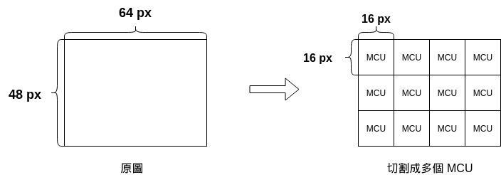

# 跟我寫 JPEG 解碼器（四）讀取壓縮圖像數據

## 本章目標

本章將會讀取 SOF0 跟 SOS。

SOF0 會提供讀取 SOS 的必要資訊， SOS 所儲存的是整個 JPEG 檔案的主體，被變換、壓縮過後的圖像數據。

| 區段 | 進度 |
|------|------|
| DQT  | ✅    |
| DHT  | ✅    |
| SOF0 | ✅    |
| SOS  | ✅    |

## JPEG 分塊機制

我們在第一章簡介 JPEG 的各種算法時，有提到 sequential 算法會由上往下解碼，這個特性可以讓在網路速度不夠的時候，即使整個 JPEG 的檔案還沒傳輸完成，就先行解碼並給網頁讀者已經接受到的部分圖片。

從這個特性中，我們察覺到， JPEG 圖檔必然是分塊進行壓縮的，因爲它不需要找到後半的數據，就已經可以解碼。

下方是圖示：

一張圖片在壓縮時會被切割成多塊正方形的 MCU ， MCU 是 Minimum Coded Unit 的縮寫，意思是最小編碼單元。

但注意，**MCU 的寬、高並不固定爲 32 px**，而是取決於一組參數。

### MCU 的組成

（待續）